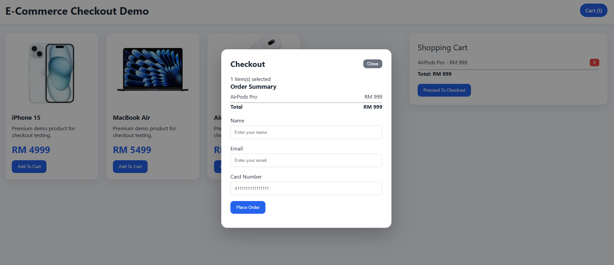
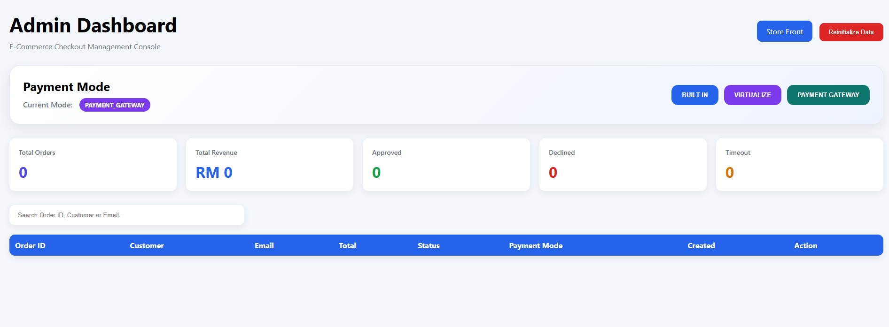
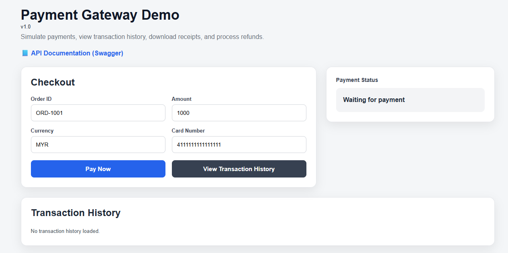

# Parasoft E-Commerce Checkout Demo

## Overview

This project demonstrates an E-Commerce checkout application integrated with multiple payment processing modes.

The solution showcases how Parasoft Virtualize can be used to simulate external payment services and enable testing without relying on real payment providers.

The demo consists of:

* E-Commerce Checkout Application
* Payment Gateway Application
* Parasoft Virtualize Services
* Admin Dashboard

---

## Screenshots

### Store Front


### Checkout Modal



### Admin Dashboard



### Payment Gateway



## Architecture

### Payment Modes

The E-Commerce application supports three payment processing modes:

### 1. BUILT_IN

The E-Commerce application processes payment requests using internal business logic.

```text
Customer
    ↓
E-Commerce
    ↓
Built-In Payment Logic
```

---

### 2. VIRTUALIZE

The E-Commerce application directly calls Parasoft Virtualize.

```text
Customer
    ↓
E-Commerce
    ↓
Parasoft Virtualize
```

---

### 3. PAYMENT_GATEWAY

The E-Commerce application calls the Payment Gateway application.

The Payment Gateway can operate in:

* Built-In Mode
* Virtualize Mode

```text
Customer
    ↓
E-Commerce
    ↓
Payment Gateway
    ↓
Built-In Logic
```

or

```text
Customer
    ↓
E-Commerce
    ↓
Payment Gateway
    ↓
Parasoft Virtualize
```

---

## Components

### E-Commerce Application

Port:

```text
http://localhost:3001
```

Features:

* Product Catalog
* Shopping Cart
* Checkout Process
* Payment Mode Switching
* Order History
* Admin Dashboard

---

### Payment Gateway Application

Port:

```text
http://localhost:3000
```

Features:

* Payment Processing
* Balance Validation
* Fraud Simulation
* Timeout Simulation
* Virtualize Integration
* Advanced Virtualize Settings

---

### Parasoft Virtualize

Port:

```text
http://localhost:9080
```

Virtual Services:

```text
/payment/charge

/payment/account/balance
```

---

## Features

### Store Front

* Product Listing
* Shopping Cart
* Checkout Modal
* Order Summary
* Payment Status Display

---

### Admin Dashboard

* Total Orders
* Total Revenue
* Approved Transactions
* Declined Transactions
* Timeout Transactions
* Search Orders
* Payment Mode Display
* Order Details View
* Reinitialize Demo Data

---

### Order Details

Each order contains:

* Order ID
* Customer Name
* Customer Email
* Purchased Items
* Total Amount
* Payment Status
* Payment Mode
* Payment Message
* Created Date

---

## Test Credit Cards

| Card Number      | Scenario             |
| ---------------- | -------------------- |
| 4111111111111111 | Approved             |
| 4000000000000002 | Declined             |
| 5555555555554444 | Timeout              |
| 4444444444444444 | Fraud                |
| 6666666666666666 | Blocked              |
| 7777777777777777 | Insufficient Balance |

---

## Example Scenarios

### Approved Payment

```text
Card Number:
4111111111111111
```

Expected Result:

```text
APPROVED
```

---

### Declined Payment

```text
Card Number:
4000000000000002
```

Expected Result:

```text
DECLINED
```

---

### Timeout Payment

```text
Card Number:
5555555555554444
```

Expected Result:

```text
TIMEOUT
```

---

### Fraud Detection

```text
Card Number:
4444444444444444
```

Expected Result:

```text
FRAUD
```

---

### Blocked Card

```text
Card Number:
6666666666666666
```

Expected Result:

```text
BLOCKED
```

---

### Insufficient Balance

Example:

```text
Balance:
1000

Purchase Amount:
5000
```

Expected Result:

```text
DECLINED

Payment Message:
Insufficient Balance
```

---

## Installation

### Clone Repository

```bash
git clone https://github.com/YOUR_USERNAME/parasoft-ecommerce-checkout-demo.git
```

---

### Install Dependencies

```bash
npm install
```

---

### Start Application

```bash
node server.js
```

---

## Access URLs

### Store Front

```text
http://localhost:3001
```

---

### Admin Dashboard

```text
http://localhost:3001/admin.html
```

---

### Payment Gateway

```text
http://localhost:3000
```

---

### Parasoft Virtualize

```text
http://localhost:9080
```

---

## Virtualize Configuration

Example Payment Service:

```text
http://localhost:9080/payment/charge
```

Example Balance Service:

```text
http://localhost:9080/payment/account/balance
```

Configure the URLs through:

```text
Payment Gateway
→ Advanced Virtualize Settings
```

---

## Technology Stack

Frontend

* HTML
* CSS
* JavaScript

Backend

* Node.js
* Express.js

Service Virtualization

* Parasoft Virtualize

Testing

* Postman
* Parasoft SOAtest

---

## Future Enhancements

Planned improvements:

* Transaction ID Support
* Refund Processing
* Payment History API
* Inventory Service
* Database Persistence
* User Authentication
* JWT Security
* Automated Test Suite
* Playwright Integration

---

## Author

Developed as a Parasoft Service Virtualization demonstration project.

Purpose:

Demonstrate how E-Commerce applications can be tested using:

* Built-In Services
* Payment Gateway Integration
* Service Virtualization
* Shift-Left Testing Practices
